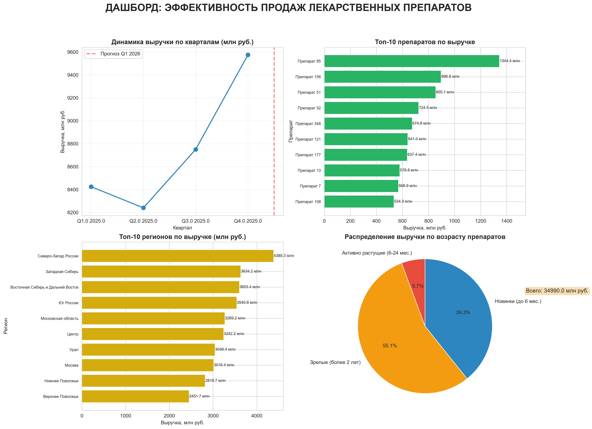

**Анализ эффективности отдела продаж фармацевтической компании.**

## 📌 О проекте

Проект представляет собой **полный аналитический отчёт** по продажам лекарственных препаратов.  
Включает:
- Загрузку и очистку данных (CSV + Excel)
- Объединение справочников
- ABC-анализ портфеля
- Прогноз выручки на следующий квартал
- Визуализацию в виде дашборда
- Выгрузку в Excel с пояснениями

---

### 📊Ключевые показатели (KPI)

| Показатель | Значение |
|:---|:---|
| Общая выручка | **34.99 млрд руб.** |
| Продано упаковок | **174.8 млн шт.** |
| Уникальных препаратов | **200** |
| Прогноз Q1 2026 | **10.0 млрд руб.** |

### Дашборд

---

## 🛠 Технологии

- **Python 3.14**
- Pandas — обработка данных
- Matplotlib / Seaborn — визуализация
- OpenPyXL — выгрузка в Excel
- NumPy — вычисления

